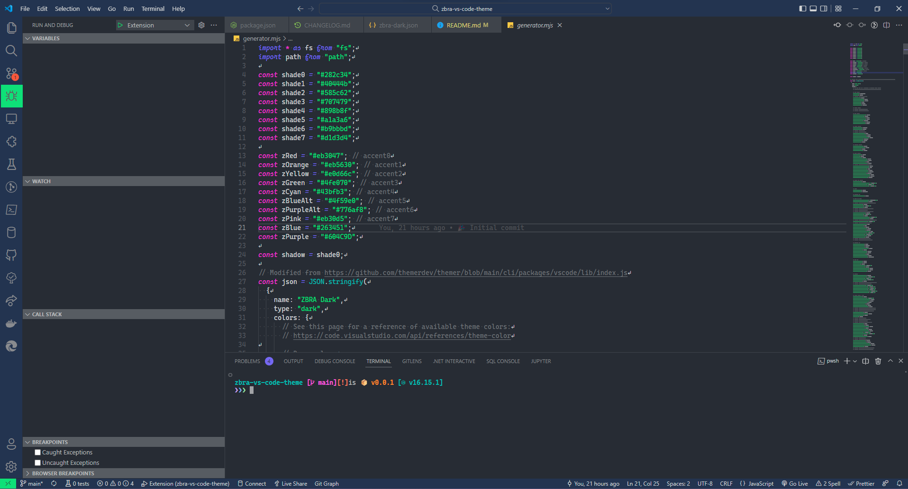

# ZBRA Theme for VS Code

A theme using ZBRA's colors.

## Contributing

Changes must be made to the `generator.mjs` file, to generate the theme, run `npm run generate`, this will generate the `themes/zbra-dark.json` theme used by the extension
